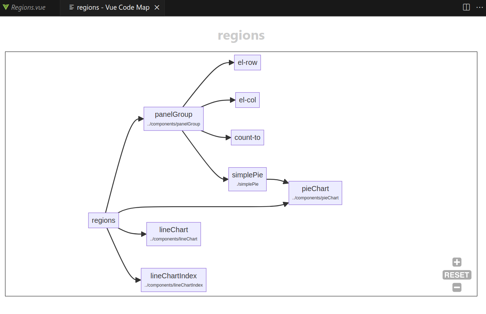

# Vue Component Map
The purpose of this extension is to generate a component map from vue code.

## How to install
* Download ```vue-component-map-0.0.1-POC.vsix```  
* Run the command 
```
code --install-extension vue-component-map-0.0.1-POC.vsix
```


## How to use
* Open a .vue file  
* Open command Palette(ctrl+shift+p)  
* search for command ```Vue Component Map```  


## Features

* Generates a component flow map  



## Requirements

* Tested with Vue2 - options api only

## Known Issues

* Unable to load imported items that use a path alias, like ```@/src/components/Header.vue```   
* Doesn't identify dynamically loaded components  
* Not tested much - so bugs are expected   

## Release Notes

### 0.0.1-POC

Just to see if this is even possible
